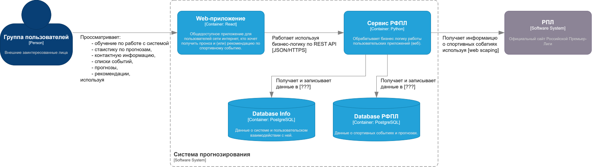
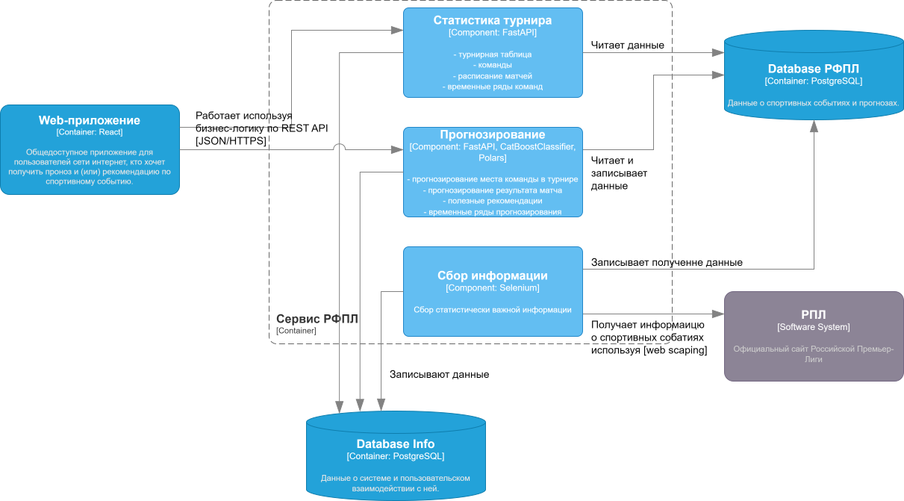
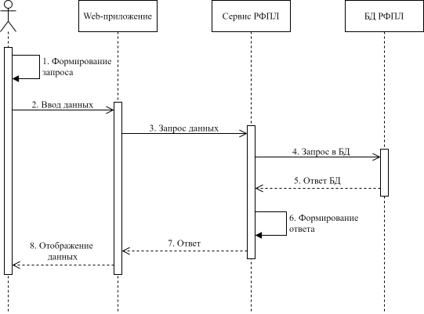
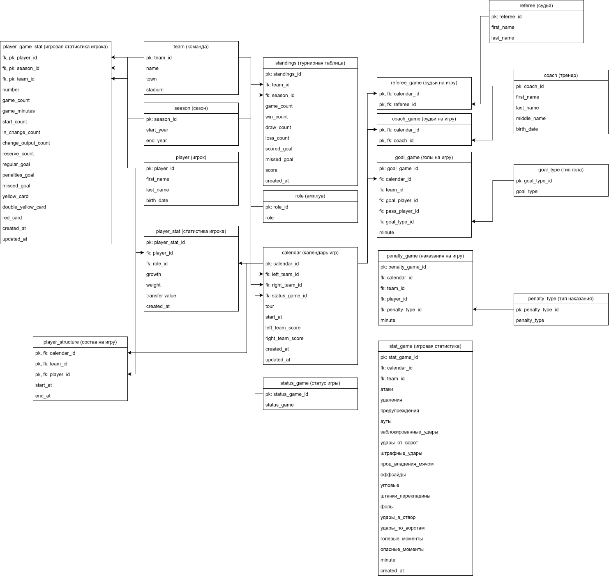

# Использование принципов проектирования на уровне методов и классов

## Диаграмма контейнеров

### C2. Диаграмма контейнеров

- **Web-приложение** - обшедоступное веб-приложение в сети интернет для пользователей, кто хочет получить прогноз и (или) рекомендацию по спортивному событию;
- **Сервис РФПЛ** - обрабатывает бизнес логику работы пользовательских приложений (веб);
- **Database Info** - База данных, хранящая результаты работ по каждому из сервисов;
- **Database РФПЛ** - База данных сервиса РФПЛ.



## Диаграмма компонентов

### C3. Диаграмма компонентов

- **Статистика турнира** - компонент, отвечающий за предоставление данных приложениям, для отображения собранной и преобразованной информации о спортивном состязании;
- **Прогнозирования** - компонент, включающий в себя модель машинного обучения и реализующий логику прогнозирования и полезных рекомендаций;
- **Сбор информации** - компонент, собирающий данные о спортивном состязании.



## Диаграмма последовательностей

### 1. "Просмотреть список событий"

Включает в себя такие расширения из вариантов использования как:
- "Отобрать события по времени";
- "Найти события по названию";
- "Перейти на следующую страницу событий";
- "Просмотреть краткий прогноз события".

---

---
Пояснение к диаграмме:
1. Формирование запроса - пользователь формирует запрос по описанным выше расширениям.
3. Запрос данных - система запрашивает API по введенным пользователем данным.
6. Формирование отчета - сервис формирует отчет по данным из БД.
7. Ответ - Web-приложение получает ответ в формате JSON.

## Модель БД

### Модель БД "Database РФПЛ"

Представленная ниже модель БД в ввиде диаграммы классов UML описывает предметную область футбол, Российская Премьер-лига и содержит все необходимые сущности и связи для дальнейшего исследования.



Примечаение:

Ноторые сущности могут быть не соединены, поскольку возникает большая избыточность в стрелках усложняя восприятие.

Проследить связь можно путем сопоставления имени ключа и названия таблицы.

## Применение основных принципов разработки

### KISS

*Keep It Simple, Stupid / Будь проще*

Данный принцип учитывается в работе. 

Используются только подходящие под специфику работы технологии:
- "Selenium" - для реализации методов веб-скрейпинга динамических сайтов;
- "SQLAlchemy" - для удобства работы с БД и легкой интеграцией с фреймворком Fast API.

*в дальнейшем данный список будет расширен*

### YAGNI

*You Aren’t Gonna Need It / Вам это не понадобится*

На данный момент ведется разработка модуля "Сбор информации", который реализует необходимый функционал для веб-скрейпинга и, который активно взаимодействует с БД "РФПЛ" записывая собранную информацию.

Для демонстрации данного принципа стоит обратить внимание на программную реализацию схемы БД "РФПЛ" с применением технологии "ORM" используя библиотеку "SQLAlchemy". [Реализация.](../src/models.py)

В БД "РФПЛ" остутсвутют сущености для взаимодействия с не реализованным модулем "Прогнозирование", но описанием новых и инструментом для работы с миграциями "Alembic" данные сущности могут быть с легкостью реализованы и структура БД будет обновлена.

### DRY

*Don’t Repeat Yourself / Не повторяйтесь*

Приведенный ниже код класса BrowserConnection позволяет исключить дублирование кода и легко изменять параметры веб-драйвера в одном месте.

```
class BrowserConnection:
    """Контекстный менеджер веб-браузера Firefox
    """
    def __init__(self):
        pass
    
    def __enter__(self):
        options = webdriver.FirefoxOptions()
        options.set_preference('dom.webdriver.enabled', False) # деактивация вебдрайвера
        options.set_preference('media.volume_scale', '0.0')
        # options.add_argument('--headless') # не запускать GUI браузера
        options.set_preference('general.useragent.override', 'useragent1')
        
        self.browser = webdriver.Firefox(options=options)
        return self.browser
    
    def __exit__(self, exc_type, exc_val, exc_tb):
        self.browser.quit()
```

Пример использования класса BroeserConnection в контекстном менеджере:

```
start_year = date(2019, 1, 1)
end_year = date(2020, 1, 1)


with BrowserConnection() as br:
    mp = MainPage(br)
    mp.go_to_page()
    mp.go_to_season(TransformDate.to_year_option_value(start_year, end_year))
    # print(mp.get_season_list())
    # print(mp.get_season_date())
    ttp = TournirTablePage(br, mp.page_href)
    print(ttp.page_href)
    ttp.go_to_page()
    time.sleep(2)
    # tmp.go_to_season(start_year, end_year)
```

### SOLID

На данный момент данный принцип не нашел свое отражение в реализованной структуре системы - черезмерное усложнение кода для веб-скрейпинга. Для веб-скрейпинга используется паттерн объетов страниц с элементами страниц и локаторами.

## Дополнительные принципы разработки

### BDUF 

*Big design up front / Масштабное проектирование прежде всего*

Подход, при котором детальное проектирование системы выполняется до начала разработки. Все требования, архитектура и интерфейсы фиксируются на ранних этапах.

**Данный принцип применим к системе.** Поскольку в реализации курсовых и дипломных работ лежит каскадная модель процесса разработки ПО, которая по сути своей требует осуществление проектирования и переход от одной фазы к другой происходит после полного и успешного завершения предыдущей.  

### SoC

*Separation оf concerns / Принцип разделения ответственности*

Разделение системы на независимые компоненты, каждый из которых решает отдельную задачу.

**Данный принцип применим к системе.** Важно создать систему базируясь на данном принципе, поскольку в своей основе лежит идея сервис-ориентированной архитектуры с независимыми сервисами, где каждый сервис отвечает за строго выделенную область спортивных состязаний.

### MVP

*Minimum viable product / Минимально жизнеспособный продукт*

Создание продукта с минимальным набором функций для быстрого выхода на рынок и сбора обратной связи.

**Данный принцип применим к системе.** В данной работе необходима быстрая проверка гипотез на реальных данных. В последствии, доработка клиенсткой части системы и добавление нового функционала.

### PoC

*Proof of concept / Доказательство концепции*

Создание упрощенной реализации идеи для проверки ее технической осуществимости.

**Данный принцип применим к системе.** Принцип может найти свое обоснование в частности построения моделей машинного обучения для прогнозирования результата игр, а также в разработке функционала полезных рекомендаций, нацеленных на улучшение прогнозируемого результата.

### Заключение

Несомненно использование всех принципов в одном проекте могут вызывать конфликты, так принцип BDUF по своей сути конфиктует с принципами MVP/PoC, также принцип BDUF вызывает конфликт с принципом SoC. Тем не менее необходимо правильно разграничить принципы к отдельным компонентам системы. 

Например PoC: 
> Принцип может найти свое обоснование в частности построения моделей машинного обучения для прогнозирования результата игр, а также в разработке функционала полезных рекомендаций, нацеленных на улучшение прогнозируемого результата

## Список использованных источников:

- [Принципы для разработки: KISS, DRY, YAGNI, BDUF, SOLID, APO и бритва Оккама](https://habr.com/ru/companies/itelma/articles/546372/)
- [Принципы SOLID на примерах](https://habr.com/ru/articles/688530/)
- [Классификация таблиц в реляционных базах данных по признакам целостности и избыточности данных](https://habr.com/ru/articles/250177/)
- [Selenium для Python. Глава 6. Объекты Страницы](https://habr.com/ru/articles/273115/)