# Проектирование REST API

## Документация по API

Описанные методы реализованы в файле [main.py](../src/main.py).

|Метод|Эндпоинт|Описание|
|---|---|---|
|`GET`|`/all_players_with_stats`|Возвращает список всех игроков с их статистикой|

Параметры: Отутствуют

Тело запроса: Отутствует

Ответ (Пример):
```
[
  {
    "first_name": "Илья",
    "last_name": "Свинов",
    "player_id": 1,
    "player_stat": [
      {
        "player_id": 1,
        "role_id": 4,
        "growth": 193,
        "weight": 79,
        "transfer_value": 600000,
        "created_at": "2023-08-20T19:30:00",
        "player_stat_id": 1,
        "role": {
          "role_id": 4,
          "role": "Вратарь"эээээээхх
        }
      }
    ]
  },
  {
    "first_name": "Вильмар",
    "last_name": "Барриос",
    "player_id": 25,
    "player_stat": []
  }
]
```

---

|Метод|Эндпоинт|Описание|
|---|---|---|
|`GET`|`/players`|Возвращает список всех игроков|

Параметры: Отутствуют

Тело запроса: Отутствует

Ответ (Пример):
```
[
  {
    "first_name": "Илья",
    "last_name": "Свинов",
    "player_id": 1
  },
  {
    "first_name": "Алексис",
    "last_name": "Дуарте",
    "player_id": 2
  }
]
```

---

|Метод|Эндпоинт|Описание|
|---|---|---|
|`GET`|`/players/{player_id}`|Возвращает игрока по идентификатору|

Параметры: player_id (path, int): Идентификатор игрока

Тело запроса: Отутствует

Ответ (Пример):
```
{
  "first_name": "Илья",
  "last_name": "Свинов",
  "player_id": 1
}
```

---

|Метод|Эндпоинт|Описание|
|---|---|---|
|`GET`|`/players/{player_id}/stats`|Возвращает статистику игрока по идентификатору|

Параметры: player_id (path, int): Идентификатор игрока

Тело запроса: Отутствует

Ответ (Пример):
```
[
  {
    "player_id": 1,
    "role_id": 4,
    "growth": 193,
    "weight": 79,
    "transfer_value": 600000,
    "created_at": "2023-08-20T19:30:00",
    "player_stat_id": 1
  }
]
```

---

|Метод|Эндпоинт|Описание|
|---|---|---|
|`GET`|`/calendars`|Возвращает список всех игр|

Параметры: Отутствуют

Тело запроса: Отутствует

Ответ (Пример):
```
[
  {
    "left_team_id": 2,
    "right_team_id": 1,
    "status_game_id": 3,
    "tour": 1,
    "start_at": "2023-08-20T19:30:00",
    "left_team_score": 1,
    "right_team_score": 3,
    "created_at": "2023-08-20T19:30:00",
    "updated_at": "2023-08-20T19:30:00",
    "calendar_id": 1,
    "left_team": {
      "name": "Спартак М",
      "town": "Москва",
      "stadium": "Лукойл Арена",
      "team_id": 2
    },
    "right_team": {
      "name": "Зенит",
      "town": "Санкт-Петербург",
      "stadium": "Газпром Арена (Санкт-Петербург)",
      "team_id": 1
    },
    "status_game": {
      "status_game_id": 3,
      "status_game": "Завершенная"
    }
  }
]
```

---

|Метод|Эндпоинт|Описание|
|---|---|---|
|`GET`|`/calendars/{calendar_id}/coaches`|Возвращает список тренеров команд по идентификатору игры|

Параметры: calendar_id (path, int): Идентификатор игры

Тело запроса: Отутствует

Ответ (Пример):
```
[
  {
    "coach": {
      "coach_id": 1,
      "first_name": "Сергей",
      "last_name": "Семак",
      "middle_name": "Богданович"
    },
    "team": {
      "name": "Зенит",
      "town": "Санкт-Петербург",
      "stadium": "Газпром Арена (Санкт-Петербург)",
      "team_id": 1
    }
  },
  {
    "coach": {
      "coach_id": 2,
      "first_name": "Деян",
      "last_name": "Станкович",
      "middle_name": null
    },
    "team": {
      "name": "Спартак М",
      "town": "Москва",
      "stadium": "Лукойл Арена",
      "team_id": 2
    }
  }
]
```

---

|Метод|Эндпоинт|Описание|
|---|---|---|
|`POST`|`/players/{player_id}/stats`|Добавляет статистику игрока по идентификатору|

Параметры: player_id (path, int): Идентификатор игрока

Тело запроса:

```
{
  "player_id": 1,
  "role_id": 4,
  "growth": 180,
  "weight": 75,
  "transfer_value": 500000,
  "created_at": "2023-08-20T19:30:00"
}
```

Ответ (Пример):
```
{
  "msg": "Запись успешно добавлена"
}
```

___

|Метод|Эндпоинт|Описание|
|---|---|---|
|`POST`|`/players`|Добавляет игрока|

Параметры: Отсутствуют

Тело запроса:

```
{
  "first_name": "Example",
  "last_name": "Example"
}
```

Ответ (Пример):
```
{
  "msg": "Игрок успешно добавлен"
}
```

---

|Метод|Эндпоинт|Описание|
|---|---|---|
|`POST`|`/calendars`|Добавляет игру|

Параметры: Отсутствуют

Тело запроса:

```
{
  "left_team_id": 0,
  "right_team_id": 0,
  "status_game_id": 0,
  "tour": 0,
  "start_at": "2023-08-20T19:30:00",
  "left_team_score": 0,
  "right_team_score": 0,
  "created_at": "2023-08-20T19:30:00",
  "updated_at": "2023-08-20T19:30:00"
}
```

Ответ (Пример):
```
{
  "msg": "Игра успешно добавлена"
}
```

---

|Метод|Эндпоинт|Описание|
|---|---|---|
|`POST`|`/coaches`|Добавляет тренера|

Параметры: Отсутствуют

Тело запроса:

```
{
  "first_name": "string",
  "last_name": "string",
  "middle_name": "string"
}
```

Ответ (Пример):

```
{
    "msg":"Тренер успешно добавлен"
}
```

---

|Метод|Эндпоинт|Описание|
|---|---|---|
|`PUT`|`/calendars/{calendar_id}`|Изменяет значение статуса игры (Активная - 1; Будущая - 2; Завершенная - 3)|

Параметры: calendar_id (path, int): Идентификатор игры

Тело запроса:

```
{
  "status_game_id": 2
}
```

Ответ (Пример):
```
{
  "msg": "Каледарь успешно обновлен"
}
```

---

|Метод|Эндпоинт|Описание|
|---|---|---|
|`DELETE`|`/calendars/{calendar_id}`|Удаляет игру по идентификатору|

Параметры: calendar_id (path, int): Идентификатор игры

Тело запроса: Отутствует

Ответ (Пример):
```
{
  "msg": "Каледарь успешно удален"
}
```

## Тестирование API

|Метод|Эндпоинт|Описание|
|---|---|---|
|`GET`|`/all_players_with_stats`|Возвращает список всех игроков с их статистикой|

Запрос:
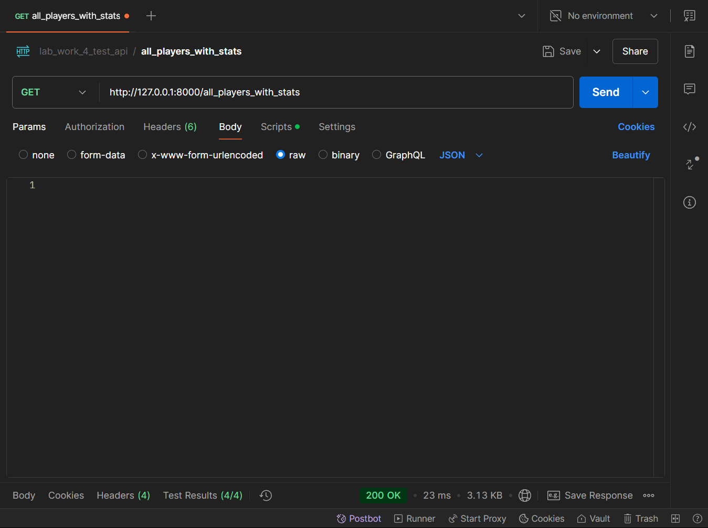

Код автотестов:
```
// 1. Проверка статуса
pm.test("Response status code is 200", function () {
    pm.response.to.have.status(200);
});

// 2. Проверка тип возвращаемых значений Json
pm.test("Response Content-Type header is application/json", function () {
    pm.expect(pm.response.headers.get("Content-Type")).to.include("application/json");
});

// 3. Проверка на массив значений
pm.test("Response is an array", function () {
    const responseData = pm.response.json();
    
    pm.expect(responseData).to.be.an('array');
});

// 4. Проверка ограничения во времени
pm.test("Response time is less than 200ms", function () {
  pm.expect(pm.response.responseTime).to.be.below(200);
});
```

Принтскрин Postman:
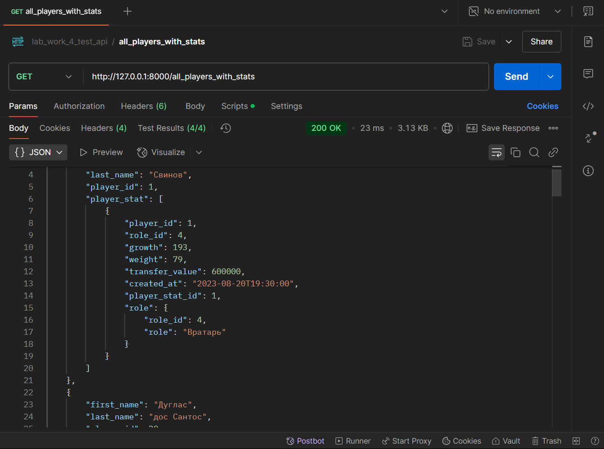

|Метод|Эндпоинт|Описание|
|---|---|---|
|`GET`|`/players/{player_id}/stats`|Возвращает статистику игрока по идентификатору|

Запрос:
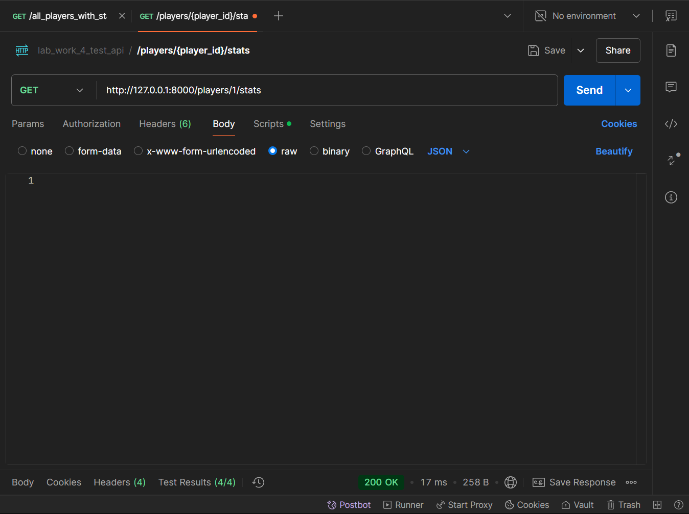

Код автотестов:
```
pm.test("Response status code is 200", function () {
    pm.response.to.have.status(200);
});

pm.test("Body contains player_id, role_id, growth, weight, transfer_value, created_at, and player_stat_id for each object in the array", function () {
    const responseData = pm.response.json();
    
    // Loop through each object in the array
    responseData.forEach((obj) => {
        pm.expect(obj).to.have.property("player_id");
        pm.expect(obj).to.have.property("role_id");
        pm.expect(obj).to.have.property("growth");
        pm.expect(obj).to.have.property("weight");
        pm.expect(obj).to.have.property("transfer_value");
        pm.expect(obj).to.have.property("created_at");
        pm.expect(obj).to.have.property("player_stat_id");
    });
});

pm.test("Response is an array", function () {
    const responseData = pm.response.json();
    
    pm.expect(responseData).to.be.an('array');
});

pm.test("Response time is less than 200ms", function () {
  pm.expect(pm.response.responseTime).to.be.below(200);
});
```

Принтскрин Postman:
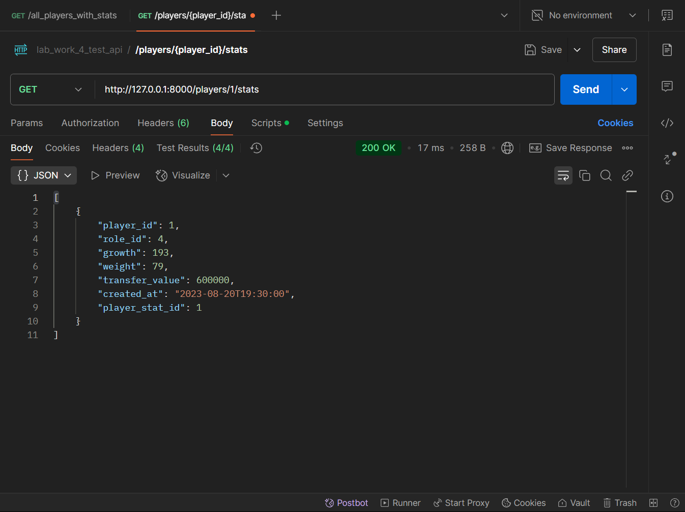

|`POST`|`/players/{player_id}/stats`|Добавляет статистику игрока по идентификатору|

Запрос:
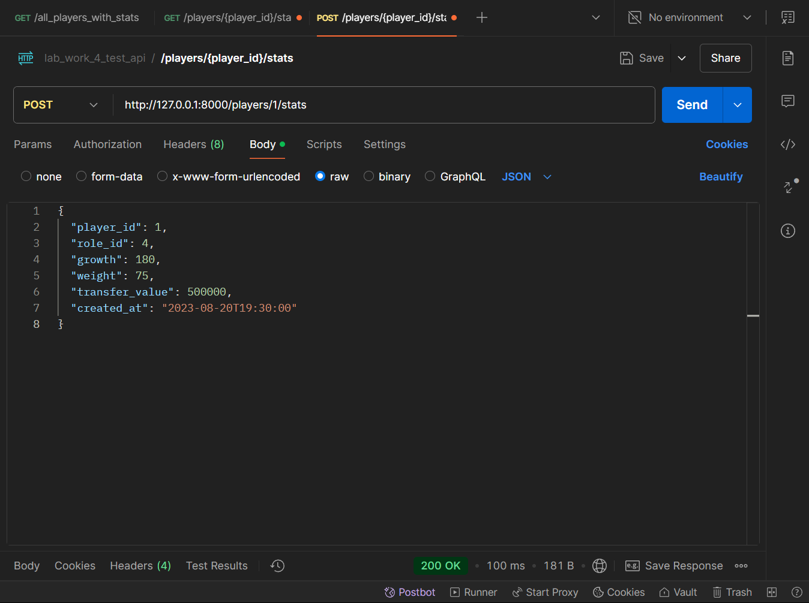

Код автотестов:
```
pm.test("Response status code is 200", function () {
  pm.expect(pm.response.code).to.equal(200);
});

pm.test("Content-Type header is application/json", function () {
    pm.expect(pm.response.headers.get("Content-Type")).to.include("application/json");
});

pm.test("Response has the required fields", function () {
    const responseData = pm.response.json();
    
    pm.expect(responseData).to.be.an('object');
    pm.expect(responseData.msg).to.exist;
});

pm.test("Verify the response message", function () {
    const responseData = pm.response.json();
    pm.expect(responseData.msg).to.equal("Запись успешно добавлена");
});

pm.test("Msg field is a non-empty string", function () {
  const responseData = pm.response.json();
  
  pm.expect(responseData).to.be.an('object');
  pm.expect(responseData.msg).to.be.a('string').and.to.have.lengthOf.at.least(1, "Msg field should not be empty");
});

pm.test("Response time is less than 200ms", function () {
  pm.expect(pm.response.responseTime).to.be.below(200);
});
```

Принтскрин Postman:
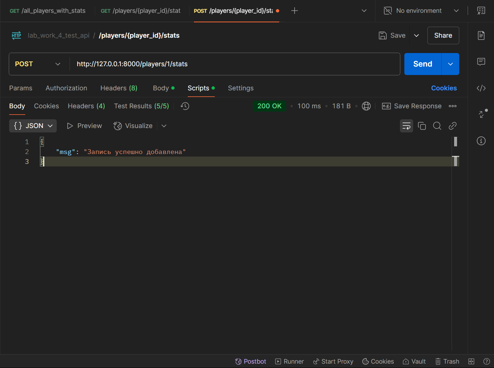

|`PUT`|`/calendars/{calendar_id}`|Изменяет значение статуса игры (Активная - 1; Будущая - 2; Завершенная - 3)|

Запрос:
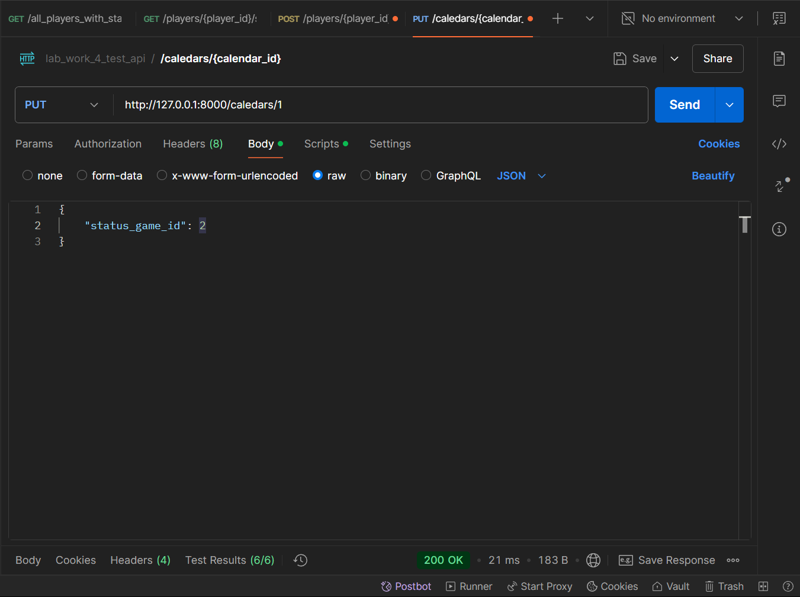

Код автотестов:
```
pm.test("Response status code is 200", function () {
  pm.expect(pm.response.code).to.equal(200);
});

pm.test("Content-Type header is application/json", function () {
    pm.expect(pm.response.headers.get("Content-Type")).to.include("application/json");
});

pm.test("Response has the required fields", function () {
    const responseData = pm.response.json();
    
    pm.expect(responseData).to.be.an('object');
    pm.expect(responseData.msg).to.exist;
});

pm.test("Verify the response message", function () {
    const responseData = pm.response.json();
    pm.expect(responseData.msg).to.equal("Каледарь успешно обновлен");
});

pm.test("Msg field is a non-empty string", function () {
  const responseData = pm.response.json();
  
  pm.expect(responseData).to.be.an('object');
  pm.expect(responseData.msg).to.be.a('string').and.to.have.lengthOf.at.least(1, "Msg field should not be empty");
});

pm.test("Response time is less than 200ms", function () {
  pm.expect(pm.response.responseTime).to.be.below(200);
});
```

Принтскрин Postman:
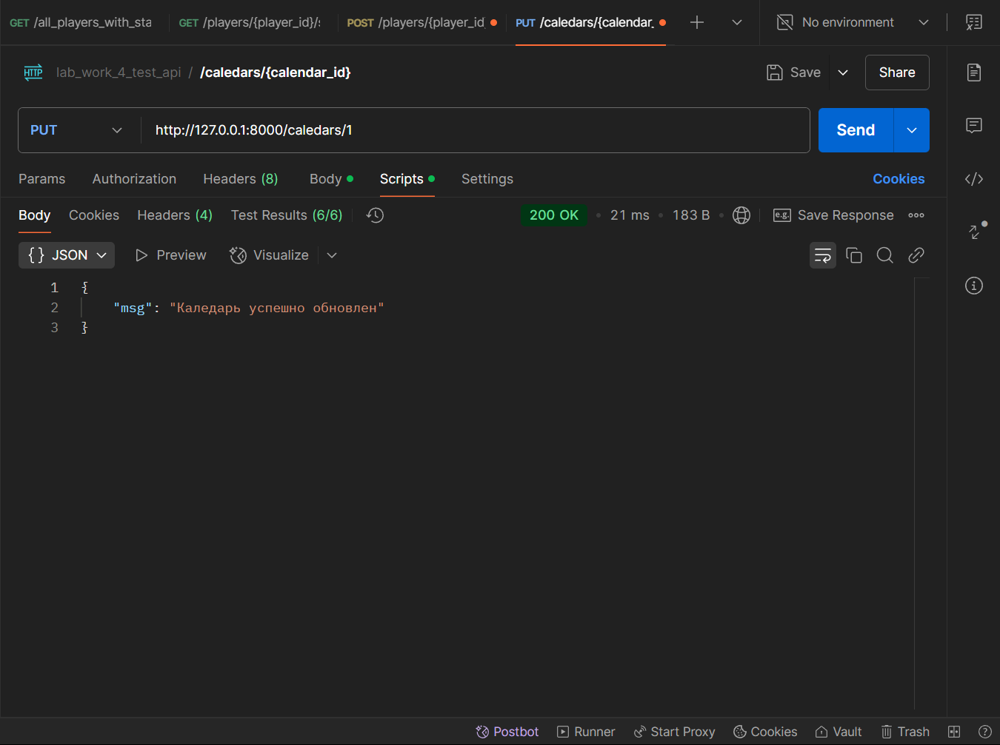

|`DELETE`|`/calendars/{calendar_id}`|Удаляет игру по идентификатору|

Запрос:
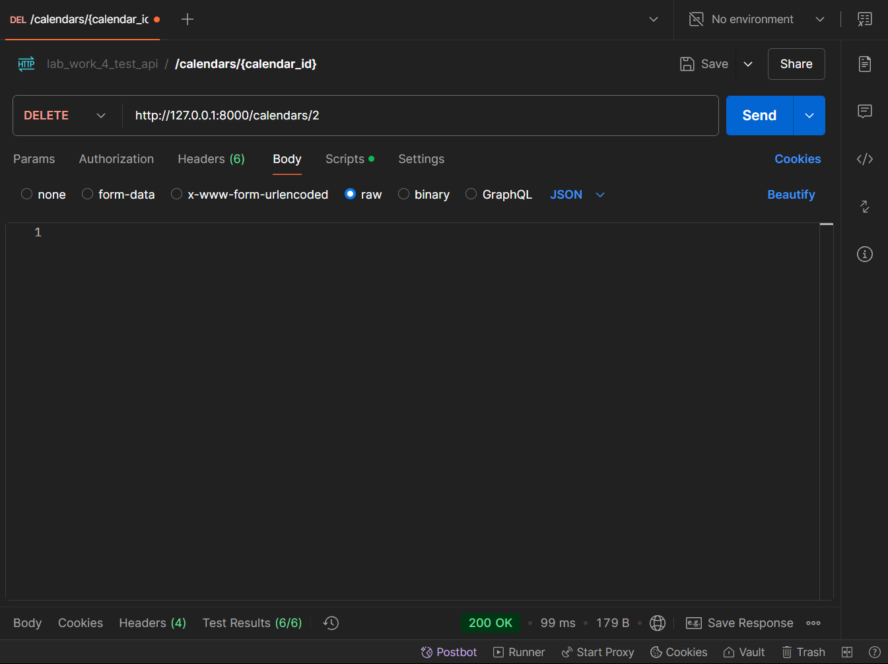

Код автотестов:
```
pm.test("Response status code is 200", function () {
  pm.expect(pm.response.code).to.equal(200);
});

pm.test("Content-Type header is application/json", function () {
    pm.expect(pm.response.headers.get("Content-Type")).to.include("application/json");
});

pm.test("Response has the required fields", function () {
    const responseData = pm.response.json();
    
    pm.expect(responseData).to.be.an('object');
    pm.expect(responseData.msg).to.exist;
});

pm.test("Verify the response message", function () {
    const responseData = pm.response.json();
    pm.expect(responseData.msg).to.equal("Каледарь успешно удален");
});

pm.test("Msg field is a non-empty string", function () {
  const responseData = pm.response.json();
  
  pm.expect(responseData).to.be.an('object');
  pm.expect(responseData.msg).to.be.a('string').and.to.have.lengthOf.at.least(1, "Msg field should not be empty");
});

pm.test("Response time is less than 200ms", function () {
  pm.expect(pm.response.responseTime).to.be.below(200);
});
```

Принтскрин Postman:
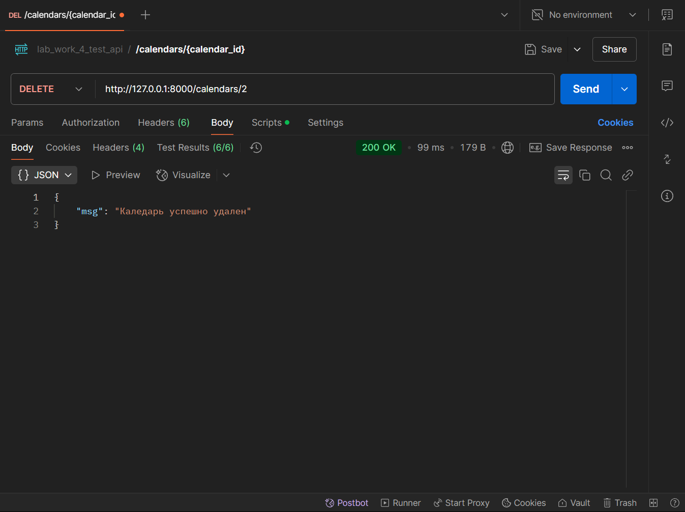

## FastAPI & Swagger
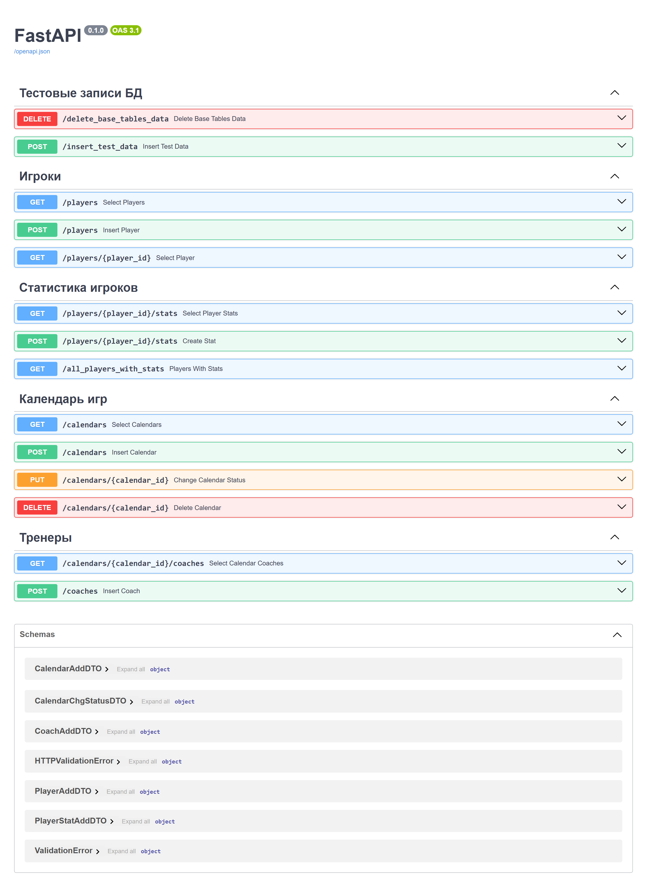